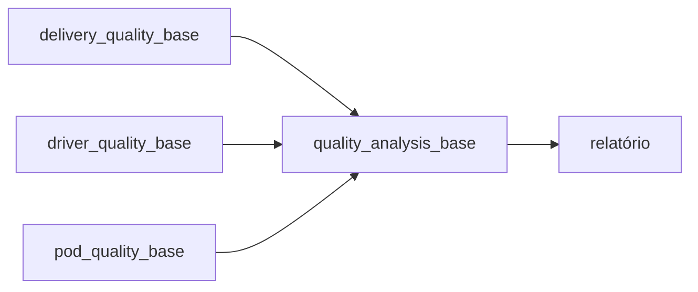

# delivery-quality-pipeline

Pipeline em SQL (Trino/Presto) que monta uma base única para analisar a qualidade das entregas de last mile: quem entregou, em qual base, qual a situação do motorista, como foi avaliado o comprovante de entrega (POD) e se o CEP do comprador está numa área de risco.

O problema é comum em operação logística: para investigar uma entrega com problema é preciso cruzar três ou quatro tabelas diferentes toda vez. Aqui tudo vira uma tabela final que já sai pronta para o relatório.

> Tabelas, códigos de status e dados deste repositório são fictícios, montados em cima de um modelo genérico de last mile.

## Fluxo



| Etapa | O que faz |
|---|---|
| `01_delivery_quality_base` | Última entrega de cada shipment nas bases de last mile e frota própria. Converte a data para o fuso de São Paulo, padroniza CEP (8 dígitos) e telefone (com 55). |
| `02_driver_quality_base` | Cadastro do motorista + status atual, pegando o registro mais recente do histórico. |
| `03_pod_quality_base` | Avaliação do POD por pacote. Os pontos sinalizados vêm numa máscara de bits e são abertos em colunas 0/1. |
| `04_quality_analysis_base` | Junta tudo, adiciona a semana ISO e o nível de risco do CEP. |

## Pontos de atenção que o código trata

- **Left join com filtro no `where`**: filtrar `rn = 1` depois de um left join transforma ele em inner join e o motorista sem histórico de status some da base. O filtro fica na condição do join.
- **CEP com zero à esquerda**: quando a tabela de risco guarda o CEP como número, `01310100` vira `1310100` e o join não bate. Os dois lados são padronizados com `lpad`.
- **Semana na virada do ano**: `year()` + `week()` gera `2027 W53` para 01/01/2027. Usando `year_of_week()` sai `2026 W53`, que é o correto na semana ISO.
- **Fuso horário**: o timestamp vem em UTC; uma entrega às 22h30 em SP cai no dia seguinte se não converter.
- **Empate no histórico**: dois registros de status no mesmo segundo são desempatados pelo id do log.

## Rodando local

As queries foram escritas para Trino/Presto. Para testar sem acesso ao data lake, tem um script que converte o SQL para DuckDB com [sqlglot](https://github.com/tobymao/sqlglot), carrega os dados fictícios de `local/seed.sql` e roda algumas checagens em cima dos casos acima.

```bash
pip install -r requirements.txt
python local/run_local.py
```

## Estrutura

```
sql/
  01_delivery_quality_base.sql
  02_driver_quality_base.sql
  03_pod_quality_base.sql
  04_quality_analysis_base.sql
local/
  seed.sql        dados fictícios
  run_local.py    executa o pipeline em DuckDB e valida o resultado
```

## Tabelas de origem (modelo fictício)

| Tabela | Conteúdo |
|---|---|
| `logistics.delivery_orders` | pedidos e tentativas de entrega |
| `logistics.drivers` | cadastro de motoristas e agência |
| `logistics.driver_status_log` | histórico de mudança de status |
| `logistics.pod_evaluations` | avaliação do comprovante de entrega |
| `ref.stations` | base → regional / sub-regional |
| `ref.risk_zipcodes` | CEPs com nível de risco |
